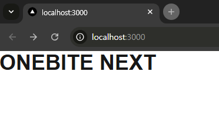
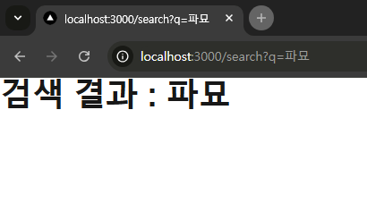
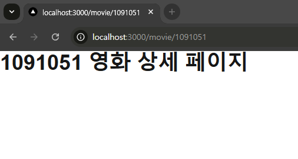

# 한입-씨네마 프로젝트

## ✅ day02

### 1. 새로운 Next App 생성하기 (Page Router 버전)

`yarn create-next-app@14 day02`

### 2. 라우팅 설정하기

- '/' 인덱스 페이지

  

- '/search' 페이지

  

- 'movie/[id] 영화 상세 페이지'

  

## ✅ day03

### 백엔드 서버 세팅하기

```
npm i
npm prisma db push // db 생성
npm run seed // db에 데이터 삽입
npm run build
npm run start
```


## ✅ day04

### 1. 글로벌 레이아웃 설정하기


### 2. 검색바 레이아웃 설정하기


